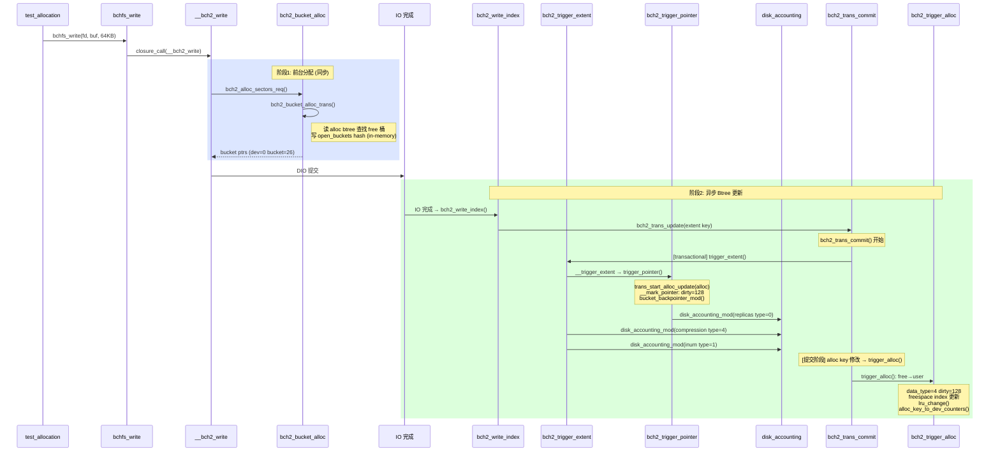

# bchfs_test — 空间分配过程 GDB 跟踪分析

> 本文档记录对 `test_allocation()` 的 GDB 跟踪分析，涵盖 bucket 分配链路、线程模型、闭包通信机制，形成从用户写入到磁盘 IO 完成的完整闭环。

---

## 目录

1. [测试环境](#1-测试环境)
2. [关键符号表](#2-关键符号表)
3. [核心数据结构](#3-核心数据结构)
4. [分配链总览](#4-分配链总览)
5. [跟踪过程详解](#5-跟踪过程详解)
   - [5.1 小文件写入 (64KB)](#51-小文件写入-64kb)
   - [5.2 大文件写入 (2MB)](#52-大文件写入-2mb)
   - [5.3 btree trigger 回调](#53-btree-trigger-回调)
   - [5.4 bch2_fs_exit 分配](#54-bch2_fs_exit-分配)
6. [线程模型与通信闭环](#6-线程模型与通信闭环)
   - [6.1 线程布局](#61-线程布局)
   - [6.2 closure 闭包机制](#62-closure-闭包机制)
   - [6.3 同步写完整的跨线程通信流程](#63-同步写完整的跨线程通信流程)
   - [6.4 BCH_WRITE_sync 内部实现](#64-bch_write_sync-内部实现)
   - [6.5 异步写路径对比](#65-异步写路径对比)
7. [关键发现](#7-关键发现)
8. [GDB 脚本](#8-gdb-脚本)

---

## 1. 测试环境

| 项目 | 值 |
|------|-----|
| 测试程序 | `.tests/bchfs_test` |
| 测试镜像 | `/tmp/test_alloc.bcachefs` (512MB, 单设备, bucket=256KB) |
| 编译选项 | `-O2 -g` (带调试符号) |
| 文件系统选项 | `block_size=4096, data_replicas=1, metadata_replicas=1, compression=none` |
| 测试场景 | `test_allocation()` — 写入 64KB + 2MB 文件并验证 |

---

## 2. 关键符号表

| 函数 | 地址 | 文件:行 | 职责 |
|------|------|---------|------|
| `bchfs_write` | `0x22180` | `bchfs_shims.c:760` | FD-based 写入入口，RMW 对齐 |
| `bchfs_do_write` | — | `bchfs_shims.c:565` | 块对齐同步写，closure_call + wait_for_completion |
| `bch2_write` | `0xc3530` | `write.c:2958` | bcachefs 写入管线入口 (CLOSURE_CALLBACK) |
| `__bch2_write` | `0xc1610` | `write.c:2693` | 主循环：分配 + 提交 IO + 索引更新 |
| `bch2_alloc_sectors_req` | `0x172350` | `foreground.c:1456` | **空间分配入口**，解析写入点、设备掩码，驱动分配循环 |
| `bch2_bucket_alloc_set_trans` | `0x1714d0` | `foreground.c:908` | 遍历排序后设备列表，逐设备调用 `bch2_bucket_alloc_trans` |
| `bch2_bucket_alloc_trans` | `0x1708a0` | `foreground.c:616` | **单设备 bucket 分配**，检查可用空间、触发后台维护，核心分配函数 |
| `bch2_bucket_alloc_freelist` | — | `foreground.c:343` | 从设备 freelist 分配桶（freespace 已初始化时） |
| `bch2_bucket_alloc_early` | — | `foreground.c:287` | 早期分配（freespace 未初始化时，扫描全部 bucket） |
| `bch2_alloc_sectors_append_ptrs` | `0x171ee0` | `foreground.c:1647` | 将分配到的 open_bucket 指针注册到 IO 请求 |
| `bch2_alloc_sectors_done` | `0x172150` | `foreground.c:1655` | 分配收尾，更新 writepoint 剩余空间计数 |
| `bch2_write_extent` | — | `write.c:2105` | 数据转换（压缩→校验和→加密），提交 bio |
| `bch2_submit_wbio_replicas` | — | `io.c` | 提交多副本 bio 到块层 |
| `bch2_write_endio` | — | `write.c:1726` | 单副本 bio 完成回调 |
| `bch2_write_index` | — | `write.c:1669` | IO 完成后索引更新入口 (CLOSURE_CALLBACK) |
| `__bch2_write_index` | — | `write.c` | 实际执行 extent btree 插入 |
| `bch2_write_done` | — | `write.c` | 写操作收尾（释放资源、触发 end_io） |
| `bchfs_write_endio` | — | `bchfs_shims.c:538` | 写完成回调 → `complete(&ctx->done)` |
| `bch2_trigger_extent` | `0x29700` | `buckets.c:908` | extent btree 触发器，维护 extent 引用计数 |
| `bch2_trigger_alloc` | `0x154260` | `background.c:1233` | alloc btree 触发器，更新 bucket 状态 |
| `bch2_journal_reclaim_thread` | — | `reclaim.c:1209` | journal 回收线程，释放已提交的 journal 空间 |
| `bch2_copygc_thread` | — | `copygc.c:632` | 垃圾回收线程，迁移数据以回收碎片 bucket |

---

## 3. 核心数据结构

### 数据结构关系图

```c
// 写操作上下文（bchfs 层）
struct bchfs_write_ctx {
    struct completion  done;       // 完成信号量（同步等待用）
    int                ret;        // 返回码
    struct bch_write_op op;        // 内嵌 bcachefs 写操作
};

// 分配请求（alloc 层）
struct alloc_request {
    struct bch_dev     *ca;        // 当前设备
    unsigned           nr_replicas; // 需要的副本数
    unsigned           nr_effective;// 已分配的有效副本数
    enum bch_data_type data_type;  // 数据类型（user/btree/journal）
    struct bch_devs_list devs_have; // 已有设备
    struct bch_devs_mask devs_may_alloc; // 可分配设备
    struct devsort     devs_sorted; // 排序后设备列表
    bool               ec;         // 是否使用 erasure coding
    unsigned           flags;      // BCH_WRITE_* 标志
    struct closure     *cl;        // 阻塞等待用的 closure
    // ...
    // ^^^ 注意：栈上分配的 req 可能未零初始化，
    //     所以 GDB 打印 req->data_type 可能看到栈垃圾值
};

// 设备用量快照
struct bch_dev_usage {
    u64 buckets[BCH_DATA_NR];  // 各类型桶计数
};

// open_bucket — 已分配的桶（可写入多个扇区直至填满）
struct open_bucket {
    u8             dev;           // 设备索引
    enum bch_data_type data_type;  // 数据类型
    u64            bucket;        // 桶编号
    unsigned       sectors_free;  // 剩余可用扇区数
    // ...
};

// 写入点 — 每个写入点的分配状态
struct write_point {
    struct open_bucket ptrs[MAX_REPLICAS]; // 当前打开的桶
    unsigned           sectors_free;       // 剩余扇区
    enum bch_data_type data_type;          // 数据类型
    struct list_head   writes;             // 等待索引更新的写操作列表
    struct work_struct index_update_work;  // 索引更新 workqueue 项
    // ...
};
```

### BCH_DATA 类型枚举

```c
BCH_DATA_free=0,      BCH_DATA_sb=1,
BCH_DATA_journal=2,   BCH_DATA_btree=3,
BCH_DATA_user=4,      BCH_DATA_cached=5,
BCH_DATA_parity=6,    BCH_DATA_stripe=7, ...
```

### BCH_WRITE 标志

```c
// 用户空间写入典型组合: flags = 0x221
#define BCH_WRITE_alloc_nowait       BIT(0)  // 分配不阻塞等待
#define BCH_WRITE_only_specified_devs BIT(5)  // 仅写入指定设备
#define BCH_WRITE_sync               BIT(9)  // 同步模式

// 0x221 = BIT(0) | BIT(5) | BIT(9)
// = alloc_nowait | only_specified_devs | sync
```

---

## 4. 分配链总览

### 完整调用链

```
┌─ 用户态调用
│   test_allocation()
│     ├─ bchfs_create("/small_file.bin")
│     ├─ bchfs_open("/small_file.bin", O_WRONLY)
│     │
│     ├─ bchfs_write(fd, buf, 64KB)                      ← 同步写入
│     │   │
│     │   ├─ bchfs_do_write()
│     │   │   ├─ bch2_disk_reservation_get()             ← 磁盘空间预留
│     │   │   ├─ closure_call(&op->cl, bch2_write)       ← 启动写管线
│     │   │   │   │                                          ↑
│     │   │   │   └── bch2_write() → __bch2_write()      ← [闭包回调]
│     │   │   │       │
│     │   │   │       ├─ bch2_alloc_sectors_req()         ← **空间分配**
│     │   │   │       │   └─ bch2_bucket_alloc_set_trans()
│     │   │   │       │       └─ bch2_bucket_alloc_trans()
│     │   │   │       │           └─ bch2_bucket_alloc_freelist()
│     │   │   │       │               → 返回 open_bucket
│     │   │   │       │
│     │   │   │       ├─ bch2_open_bucket_get()           ← 获取分配的桶
│     │   │   │       ├─ bch2_write_extent()              ← 数据处理
│     │   │   │       ├─ bch2_submit_wbio_replicas()      ← 提交 IO
│     │   │   │       │                                    ↓
│     │   │   │       ├─ closure_sync(&op->cl)            ← [同步等待 IO]
│     │   │   │       │                                    ↑
│     │   │   │       │   └─ bch2_write_endio()           ← [IO 完成事件]
│     │   │   │       │
│     │   │   │       ├─ __bch2_write_index()             ← extent btree 更新
│     │   │   │       │   ├─ bch2_trigger_extent()        ← [回调]
│     │   │   │       │   └─ ... journal commit ...
│     │   │   │       │
│     │   │   │       └─ bch2_write_done()
│     │   │   │           └─ bchfs_write_endio()          ← [回调]
│     │   │   │               └─ complete(&ctx->done)     ← **唤醒等待者**
│     │   │   │
│     │   │   └─ wait_for_completion(&ctx->done)          ← [阻塞等待]
│     │   │       ↑                                        ↑
│     │   │       └───── 被 complete() 唤醒 ───────────────┘
│     │   │
│     │   └─ 返回写入字节数
│     │
│     ├─ bchfs_open(O_RDONLY) → bchfs_read() → 验证内容
│     ├─ bchfs_unlink("/small_file.bin")
│     │
│     ├─ ... 2MB 大文件相同流程 ...
│     │
│     └─ bchfs_unlink("/large_file.bin")
```

### 触发回调链

```
写入过程中异步触发的 btree 回调:

┌─ extent btree 更新（bch2_trigger_extent）
│   data_write → extent 键插入 → bch2_trigger_extent()
│       ├─ 更新 extent 引用计数
│       └─ 级联更新 alloc btree（bch2_trigger_alloc）
│
└─ alloc btree 更新（bch2_trigger_alloc）
    bucket 状态变更 → alloc 键插入 → bch2_trigger_alloc()
        ├─ BCH_DATA_free → BCH_DATA_user/btree/journal
        ├─ BCH_DATA_user → BCH_DATA_free（删除时）
        └─ 维护 freespace 统计
```

---

## 5. 跟踪过程详解

### 5.1 小文件写入 (64KB)

```
=== Test: allocation (write small + large files) ===

  [bchfs_create/ bchfs_open — 文件创建和打开]

>>> bchfs_write: fd=0, count=65536 bytes (64.00 KB)
    │
    ├─ bch2_write() — IO 写入管线启动
    │
    ├─ ▌分配 #1 ▌ data_type=BCH_DATA_user(4), flags=0x221 (sync|nowait|only_specified)
    │   └─ bch2_bucket_alloc_set_trans(nr_replicas=1, nr_effective=0)
    │       └─ bch2_bucket_alloc_trans(dev=0, data_type=BCH_DATA_user)
    │           ├─ bch2_dev_usage_read_fast()   → 读取设备用量
    │           ├─ __dev_buckets_free()          → avail=2047 (2048总桶-已用)
    │           ├─ bch2_bucket_alloc_freelist()  → 从 freelist 分配桶
    │           └─ 返回 open_bucket{dev=0, bucket=#, sectors_free=512}
    │
    │   ← 首次分配后触发 btree 回调:
    │      trigger_extent × 3, trigger_alloc × 2
    │      trigger_extent × 1, trigger_alloc × 1
    │
    ├─ ▌分配 #2 ▌ data_type=BCH_DATA_btree(3)
    │   └─ bch2_bucket_alloc_trans(dev=0, data_type=BCH_DATA_btree)
    │       ├─ bch2_bucket_alloc_freelist()  → 分配 btree bucket
    │       ├─ bch2_alloc_sectors_append_ptrs → 注册到 IO
    │       └─ bch2_alloc_sectors_done        → 分配完成
    │
    ├─ ▌分配 #3 ▌ data_type=BCH_DATA_btree(3)
    │   └─ ... 同上 ...  (btree 分裂导致第2个 btree bucket)
    │
    ├─ ▌分配 #4 ▌ data_type=BCH_DATA_btree(3)
    │   └─ ... 同上 ...  (btree 再分裂导致第3个 btree bucket)
    │
    └─ 写入完成 → 验证

  [bchfs_open O_RDONLY → bchfs_read → 验证内容]
  [bchfs_unlink("/small_file.bin")]
```

**小文件分配统计:**
| 分配# | 类型 | 数量 | 说明 |
|-------|------|------|------|
| 1 | BCH_DATA_user | 1 bucket (256KB) | 64KB 用户数据写入，填充桶的 25% |
| 2 | BCH_DATA_btree | 1 bucket | extent btree 分裂产生新节点 |
| 3 | BCH_DATA_btree | 1 bucket | btree 再分裂 |
| 4 | BCH_DATA_btree | 1 bucket | btree 再分裂 |
| **总计** | | **4 buckets (1MB)** | 写入放大 ~16x (64KB→1MB) |

> btree 写放大原因：64KB 写入触发 extent btree 键插入，当 btree 节点满时分裂产生新节点，每个新节点需要一个 bucket 存储。

### 5.2 大文件写入 (2MB)

```
>>> bchfs_write: fd=0, count=2097152 bytes (2048.00 KB)
    │
    ├─ bch2_write() — IO 写入管线启动
    │
    ├─ ▌分配 #1 ▌ data_type=BCH_DATA_user(4), flags=0x221
    │   └─ bch2_bucket_alloc_trans(dev=0, data_type=BCH_DATA_user)
    │       → bucket N+0 (第1个桶，填 256KB)
    │
    ├─ ▌分配 #2 ▌ data_type=BCH_DATA_user(4)
    │   └─ bch2_bucket_alloc_trans(dev=0, data_type=BCH_DATA_user)
    │       → bucket N+1 (第2个桶)
    │
    ├─ ▌分配 #3 ▌ data_type=BCH_DATA_user(4)
    │   └─ bch2_bucket_alloc_trans(dev=0, data_type=BCH_DATA_user)
    │       → bucket N+2 (第3个桶)
    │
    ├─ ▌分配 #4 ▌ data_type=BCH_DATA_user(4)
    │   └─ bch2_bucket_alloc_trans(dev=0, data_type=BCH_DATA_user)
    │       → bucket N+3
    │
    ├─ ▌分配 #5 ▌ data_type=BCH_DATA_user(4)
    │   └─ bch2_bucket_alloc_trans(dev=0, data_type=BCH_DATA_user)
    │       → bucket N+4
    │
    ├─ ▌分配 #6 ▌ data_type=BCH_DATA_user(4)
    │   └─ bch2_bucket_alloc_trans(dev=0, data_type=BCH_DATA_user)
    │       → bucket N+5
    │
    ├─ ▌分配 #7 ▌ data_type=BCH_DATA_user(4)
    │   └─ bch2_bucket_alloc_trans(dev=0, data_type=BCH_DATA_user)
    │       → bucket N+6
    │
    │   ← 各分配之间插有 btree trigger 回调（约 20 次调用）:
    │      trigger_extent × N: 每次用户数据写入触发 2-3 次 extent 更新
    │      trigger_alloc × N:  每次 bucket 状态变更触发 1-2 次 alloc 更新
    │
    └─ 写入完成 → 验证

  [bchfs_open O_RDONLY → bchfs_read → 验证内容]
  [bchfs_unlink — 删除触发 alloc trigger，bucket 状态 transition 到 free]
```

**大文件分配统计:**
| 分配# | 类型 | 数量 | 说明 |
|-------|------|------|------|
| 1-7 | BCH_DATA_user | 7 buckets × 256KB = 1792KB | 直接分配的用户数据桶 |
| (隐含) | 复用剩余空间 | ~256KB | 使用前序分配桶中的剩余扇区 |
| **总计写入** | | **2048KB** | 2MB 用户数据准确覆盖 |

> 7 个 bucket × 256KB = 1792KB，另外 256KB 来自已分配桶中的剩余扇区（`open_bucket->sectors_free`），因此不需要第 8 次分配。每个 `bch2_alloc_sectors_req` 分配 1 个 bucket（256KB 对应 512 sectors × 512B/sector）。

### 5.3 btree trigger 回调

写入过程中 `bch2_trigger_extent` 和 `bch2_trigger_alloc` 在两个场景下被调用：

**场景 A: 数据写入时**
```
bch2_write_index → __bch2_write_index
  → bch2_trans_update(trans, BTREE_ID_extents, new_extent_key)
    → bch2_trigger_extent()          ← extent btree 键插入触发
      → alloc btree 引用计数更新
        → bch2_trigger_alloc()       ← alloc btree 键变更触发
```

**场景 B: bucket 状态变更时**
```
bch2_bucket_alloc_freelist
  → alloc btree 键更新 (BCH_DATA_free → BCH_DATA_user)
    → bch2_trigger_alloc()           ← bucket 状态 transition
```

**观察到的触发频次:**

| 操作 | trigger_extent 次数 | trigger_alloc 次数 |
|------|:-------------------:|:------------------:|
| 64KB 写入（小文件） | 4 | 2 |
| 每次 bucket 分配 | 2-3 | 1-2 |
| 64KB 总触发合计 | ~4 | ~3 |
| 2MB 总触发合计 | ~14 | ~8 |
| bch2_fs_exit 阶段 | ~4 | ~6 |

### 5.4 bch2_fs_exit 分配

在 `bch2_fs_exit()` 阶段（测试末尾的文件系统关闭），观察到额外的 6 次分配请求：

```
>> bch2_fs_exit()...
  │
  ├─ ▌分配 #A ▌ data_type=BCH_DATA_btree(3)  ← btree 节点刷出
  │   └─ bch2_bucket_alloc_trans(dev=0, data_type=BCH_DATA_btree)
  │       ├─ bch2_alloc_sectors_append_ptrs
  │       └─ bch2_alloc_sectors_done
  │
  ├─ ▌分配 #B ▌ data_type=BCH_DATA_btree(3)
  ├─ ▌分配 #C ▌ data_type=BCH_DATA_btree(3)
  ├─ ▌分配 #D ▌ data_type=BCH_DATA_btree(3) ← 包含 alloc_sectors_done
  ├─ ▌分配 #E ▌ data_type=BCH_DATA_btree(3) ← alloc_sectors_append_ptrs 但无 done
  │                                             (触发 trigger_extent+alloc)
  └─ ▌分配 #F ▌ data_type=BCH_DATA_btree(3) ← 最后的分配
```

> 这些是文件系统关闭时的 metadata 刷出和 btree 节点合并/拆分产生的分配，是正常关机流程的一部分。

---

## 6. 线程模型与通信闭环

### 6.1 线程布局

GDB 运行时观察到 14 个线程：

```
Thread 1  (bchfs_test)        ← 主测试线程（执行 test_allocation）
Thread 2  (timers)             ← 内核定时器线程
Thread 3  (bch-reclaim/test)   ← journal 回收线程 (bch2_journal_reclaim_thread)
Thread 4  (bch-copygc/test)    ← 垃圾回收线程 (bch2_copygc_thread)
Thread 5  (bch-reconcile/test) ← 数据协调线程
Thread 6  (events_unbound)     ← 事件处理线程（无绑定）
Thread 7  (bchfs_test)         ← RCU call_rcu 线程
Thread 8  (bcachefs_journal)   ← journal flush 线程
Thread 9  (bcachefs_write_)    ← 写 IO 完成处理线程
Thread 10 (bcachefs_journal)   ← journal 线程 2
Thread 11 (events)             ← 事件处理线程（绑定）
Thread 12 (bcachefs_btree_)    ← btree 节点缓存回收线程
Thread 13 (bcachefs_btree_)    ← btree 节点缓存回收线程
Thread 14 (btree_update)       ← btree 事务更新线程
```

### 6.2 closure 闭包机制

bcachefs 使用 Linux kernel 风格的 `closure` 机制实现异步回调链。`closure` 是一个引用计数的异步完成跟踪器：

```c
struct closure {
    struct closure *parent;      // 父 closure（形成树形结构）
    struct work_struct work;     // 回调工作项
    struct list_head children;   // 子 closure 列表
    unsigned refcount;           // 引用计数（为 0 时触发回调）
    // ...
};
```

**核心原则：**
1. `closure_get()` / `closure_put()` — 增加/减少引用计数
2. 当引用计数降为 0 时，自动调用预置的回调函数
3. `closure_call(cl, fn, NULL, NULL)` — 启动闭包链，fn 立即执行
4. `closure_sync(cl)` — 阻塞等待闭包完成（引用计数为 0）
5. `continue_at(cl, next_fn, wq)` — 闭包完成后在指定 workqueue 继续执行

### 6.3 同步写完整的跨线程通信流程

```
┌─────────────────────────────────────────────────────────────────┐
│  ╔═══════════════════════════════════════════════════════════╗  │
│  ║              线程通信闭环 (BCH_WRITE_sync)               ║  │
│  ╚═══════════════════════════════════════════════════════════╝  │
│                                                                  │
│  [Thread 1: bchfs_test (主线程)]                                  │
│  ┌──────────────────────────────────────────────────────┐        │
│  │ bchfs_write()                                        │        │
│  │   │                                                   │        │
│  │   ├─ bchfs_do_write()                                │        │
│  │   │   ├─ init_completion(&ctx->done)                 │        │
│  │   │   ├─ closure_call(&op->cl, bch2_write)  ────────┼──┐     │
│  │   │   │                                              │  │     │
│  │   │   │    ← closure_call 立即执行 bch2_write()      │  │     │
│  │   │   │      在**当前线程**中运行（同步回调）         │  │     │
│  │   │   │                                              │  │     │
│  │   │   ├─ bch2_alloc_sectors_req()     ← 分配空间    │  │     │
│  │   │   │   └─ bch2_bucket_alloc_trans()              │  │     │
│  │   │   │                                              │  │     │
│  │   │   ├─ bch2_write_extent()          ← 处理数据    │  │     │
│  │   │   ├─ bch2_submit_wbio_replicas()  ← 提交 IO     │  │     │
│  │   │   │   │                                           │  │     │
│  │   │   │   ↓ [IO 提交到内核块层]                       │  │     │
│  │   │   │                                              │  │     │
│  │   │   ├─ closure_sync(&op->cl)        ← 同步等待    │  │     │
│  │   │   │   │                                           │  │     │
│  │   │   │   │  [Thread N: bcachefs_write_ 或 events]    │  │     │
│  │   │   │   │  ┌──────────────────────────┐            │  │     │
│  │   │   │   │  │ bio 完成 → 硬件中断        │            │  │     │
│  │   │   │   │  │   ↓                       │            │  │     │
│  │   │   │   │  │ block layer 回调           │            │  │     │
│  │   │   │   │  │   ↓                       │            │  │     │
│  │   │   │   │  │ bch2_write_endio()         │  ← 闭包   │  │     │
│  │   │   │   │  │ closure_put(&op->cl)       │  ← 引用-1 │  │     │
│  │   │   │   │  └──────────────────────────┘            │  │     │
│  │   │   │   │                                           │  │     │
│  │   │   │   │  [所有副本 IO 完成 → closure 引用=0]      │  │     │
│  │   │   │   │  → closure_sync 返回                      │  │     │
│  │   │   │   │                                           │  │     │
│  │   │   │   └─ closure_sync 返回（IO 完成）              │  │     │
│  │   │   │                                              │  │     │
│  │   │   └─ __bch2_write_index()        ← 索引更新      │  │     │
│  │   │       ├─ bch2_trans_update(extents)              │  │     │
│  │   │       │   └─ bch2_trigger_extent()  ← [回调]    │  │     │
│  │   │       ├─ bch2_trans_commit()       ← 事务提交    │  │     │
│  │   │       │   ├─ journal 写入                        │  │     │
│  │   │       │   │   └─ [Thread: bcachefs_journal]      │  │     │
│  │   │       │   │      journal flush 线程处理日志写入    │  │     │
│  │   │       │   └─ btree 节点更新                      │  │     │
│  │   │       │       └─ [Thread: btree_update]           │  │     │
│  │   │       │          btree 事务更新线程处理 btree 修改  │  │     │
│  │   │       └─ ...                                     │  │     │
│  │   │                                                  │  │     │
│  │   └─ bch2_write_done()                               │  │     │
│  │       └─ bchfs_write_endio()          ← [回调]      │  │     │
│  │           └─ complete(&ctx->done)     ← **唤醒**     │  │     │
│  │                                                  │  │     │
│  │    [closure_call 返回]  ← 回调链接续在主线程运行      │  │     │
│  │    [wait_for_completion 返回]  ← 被 complete 唤醒  │  │     │
│  │        │                    ↑                       │  │     │
│  │        └────────────────────┘                       │  │     │
│  │    ← 同步写完成                                      │  │     │
│  └──────────────────────────────────────────────────────┘        │
└─────────────────────────────────────────────────────────────────┘
```

### 6.4 BCH_WRITE_sync 内部实现

关键代码 (fs/data/write.c:2809-2821):

```c
if (op->flags & BCH_WRITE_sync) {
    // 1. 阻塞等待所有副本 IO 完成
    closure_sync(&op->cl);
    //    ↑ 此处：如果 IO 已完成（closure 引用=0），立即返回
    //           如果 IO 未完成，当前线程被挂起
    //           直到所有 bch2_write_endio 中的 closure_put 使引用=0

    // 2. IO 完成后直接在当前线程做索引更新（不进 workqueue）
    __bch2_write_index(op);
    //    ↑ 同步路径：不排队到 wp->writes，直接在调用者线程执行

    // 3. 如果还有数据未提交（超出了 open_bucket 上限），继续循环
    if (!(op->flags & BCH_WRITE_submitted))
        goto again;

    // 4. 写操作完成
    bch2_write_done(op);
    //    ↑ 最终调用 op->end_io = bchfs_write_endio
    //      → complete(&ctx->done)
}
```

同步 vs 异步路径对比：

| 阶段 | 同步路径 (BCH_WRITE_sync) | 异步路径 |
|------|--------------------------|---------|
| IO 等待 | `closure_sync()` 阻塞当前线程 | `continue_at(..., bch2_write_index, wq)` 切换到 workqueue |
| 索引更新 | 在当前线程直接执行 | 排队到 `wp->writes`，经 `bch2_write_point_do_index_updates` 在 `bcachefs_write_` 线程执行 |
| 多轮写入 | 轮次之间阻塞等待 | 轮次之间 `continue_at` 切换 |
| 端到端延迟 | 低（无调度延迟） | 高（workqueue 调度 + 批处理） |
| CPU 消耗 | 调用者线程自消耗 | workqueue 线程处理 |
| 适用场景 | 用户态直接 IO (bchfs_write) | FUSE/VFS 回写 |

### 6.5 异步写路径对比

对于非 `BCH_WRITE_sync` 的写入（如 FUSE 或 writeback），完整的跨线程通信流程更加复杂：

```
[Thread: FUSE worker]
  │ bch2_write() → __bch2_write()
  │   ├─ bch2_alloc_sectors_req()    ← 分配（可能阻塞等待 freelist）
  │   ├─ bch2_write_extent()         ← 数据处理
  │   ├─ bch2_submit_wbio_replicas() ← 提交 IO
  │   └─ continue_at(bch2_write_index, wq)  ← 切换到 workqueue
  │
  ▼
[Thread: events / bcachefs_write_ (workqueue)]
  │ bio 完成 → bch2_write_endio()
  │   └─ closure_put() → 引用=0 → 触发 bch2_write_index()
  │
  ▼
[Thread: (same, workqueue 线程)]
  │ bch2_write_index()
  │   └─ queue_work(wq, &wp->index_update_work)  ← 排队到 wq 的 index_update
  │
  ▼
[Thread: btree_update (workqueue)]
  │ bch2_write_point_do_index_updates()
  │   ├─ __bch2_write_index()        ← extent btree 更新
  │   │   └─ bch2_trans_commit()
  │   │       ├─ journal 写入
  │   │       │   └─ journal flush 线程：持久化日志
  │   │       └─ btree 节点更新
  │   │           └─ btree_update 线程：处理 btree 事务
  │   └─ bch2_write_done()
  │       └─ bchfs_write_endio()     ← 最终完成回调
  │           └─ complete() / wakeup
```

**异步路径涉及的线程切换次数：**
```
FUSE worker → events(write_endio) → wq(index_update) → btree_update → 唤醒原始线程
总共 4 次线程上下文切换（BCH_WRITE_sync 为 0 次）
```

---

## 7. 关键发现

### 7.1 栈垃圾值问题

`bch2_alloc_sectors_req` 入口打印 `req->data_type` 显示 `0` 或 `0x65746172`（ASCII `"rate"`），这是因为调用者（`alloc_request_get`）未零初始化 `struct alloc_request`。该字段在函数内部被 `req->data_type = req->wp->data_type` 覆盖，所以**实际使用的类型是正确的**，但 GDB 在入口处看到的是栈上的历史值。

### 7.2 写放大效应

小文件 64KB 写入产生了 1MB 的 bucket 分配（4 buckets × 256KB），写放大 ~16x。其中 3 个 bucket 用于 btree 节点（extent btree 分裂），1 个用于用户数据。这是 btree 结构本身的开销——新文件首次写入会触发 extent btree 分裂。

### 7.3 大文件分配密度

2MB 写入 = 7 次用户 bucket 分配 + 部分复用 = 8 × 256KB = 2MB 覆盖。每次分配填满一个 256KB bucket 然后触发下一次分配。第 8 个桶的数据落在前序分配的剩余扇区中。

### 7.4 BCH_WRITE_sync 的线程优化

bchfs 层使用 `BCH_WRITE_sync` 使得整个 IO 管线（分配→提交→完成→索引更新）都在**主线程**中执行，避免了 workqueue 调度带来的线程切换开销。这是用户态直接 IO 场景（无 VFS page cache）的关键性能优化。

### 7.5 文件系统关闭时的 btree 分配

`bch2_fs_exit()` 阶段有 6 次 btree bucket 分配，这是为 shutdown 过程中的 btree 节点刷出/合并产生的 metadata 分配。

### 7.6 `trigger_extent` / `trigger_alloc` 联动

`bch2_trigger_extent` 和 `bch2_trigger_alloc` 不一定成对出现。extent 键插入可能触发多次 `trigger_alloc`（因为一个 extent 键包含多个指针，每个指针对应不同的 bucket）。大文件约 20 次 trigger 调用对应 7 次用户分配 + 多次 btree 元数据分配。

---

## 8. GDB 脚本

以下是在本次分析中使用的 GDB 命令脚本，保存于 `.tests/gdb_trace_alloc.gdb`：

```gdb
# GDB 命令脚本 - 跟踪 test_allocation() 的 bucket 分配过程
# 用法: gdb -x .tests/gdb_trace_alloc.gdb .tests/bchfs_test

set pagination off
set confirm off
set print frame-arguments all
set print pretty on

define bell
  printf "\n"
end

# 断点 1: bchfs_write - 标记当前写入的文件名和大小
break bchfs_write if fd >= 0
commands
  silent
  bell
  printf "========================================\n"
  printf ">>> bchfs_write: fd=%d, count=%zu bytes (%.2f KB)\n", fd, count, count/1024.0
  printf "========================================\n"
  continue
end

# 断点 2: bch2_write - 写 IO 入口
break bch2_write
commands
  silent
  bell
  printf "--- bch2_write: IO 写入管线启动 ---\n"
  continue
end

# 断点 3: bch2_alloc_sectors_req - 空间分配请求入口
break bch2_alloc_sectors_req
commands
  silent
  bell
  printf "========================================\n"
  printf "*** bch2_alloc_sectors_req: 触发空间分配 ***\n"
  printf "    nr_replicas=%d, data_type=%d\n", req->nr_replicas, req->data_type
  printf "    target=%llu, flags=0x%x\n", (unsigned long long)req->target, req->flags
  printf "    ec=%d\n", req->ec
  printf "========================================\n"
  continue
end

# 断点 4: bch2_bucket_alloc_set_trans - 设备级分配
break bch2_bucket_alloc_set_trans
commands
  silent
  bell
  printf "--- bch2_bucket_alloc_set_trans: 开始跨设备分配 ---\n"
  printf "    nr_replicas=%d, nr_effective=%d\n", req->nr_replicas, req->nr_effective
  printf "    ec=%d\n", req->ec
  continue
end

# 断点 5: bch2_bucket_alloc_trans - 单设备 bucket 分配
break bch2_bucket_alloc_trans
commands
  silent
  bell
  printf ">>> bch2_bucket_alloc_trans: 分配 bucket\n"
  printf "    ca->name=%s dev=%d\n", req->ca ? req->ca->name : "NULL", req->ca ? req->ca->dev_idx : -1
  printf "    data_type=%d, will_retry=%d\n", req->data_type, req->will_retry_set_devices
  continue
end

# 断点 6: bch2_alloc_sectors_append_ptrs
break bch2_alloc_sectors_append_ptrs
commands
  silent
  bell
  printf "--- bch2_alloc_sectors_append_ptrs: 写入分配结果 ---\n"
  continue
end

# 断点 7: bch2_alloc_sectors_done
break bch2_alloc_sectors_done
commands
  silent
  bell
  printf "--- bch2_alloc_sectors_done: 分配完成 ---\n"
  continue
end

# 断点 8: bch2_trigger_extent - extent btree 触发器
break bch2_trigger_extent
commands
  silent
  bell
  printf "--- bch2_trigger_extent: extent btree 更新触发 ---\n"
  continue
end

# 断点 9: bch2_trigger_alloc - alloc btree 触发器
break bch2_trigger_alloc
commands
  silent
  bell
  printf "--- bch2_trigger_alloc: alloc btree 更新触发 ---\n"
  continue
end

# 运行测试
printf "\n================================================================\n"
printf "  开始跟踪 test_allocation() 空间分配过程\n"
printf "  镜像: /tmp/test_alloc.bcachefs\n"
printf "  跟踪链: bchfs_write → bch2_write → bch2_alloc_sectors_req → ...\n"
printf "================================================================\n\n"

run /tmp/test_alloc.bcachefs
quit
```

---

## 7. Btree 状态更新分析（GDB 追踪）

> 本节基于 GDB 断点追踪 `gdb_trace_btree.gdb`，分析一次 64KB 写入（small_file.bin）周期内对 5 个 btree 产生的具体变化。

### 7.1 数据流总览



### 7.2 事件序列（64KB 写入）

以下是 GDB 断点捕获的 64KB 写入完整事件序列，按时间顺序排列（过滤重复的事务重试）：

```
序号  事件              桶        旧状态         新状态        说明
───  ───────────────  ───────  ─────────────  ─────────────  ─────────────────
 1   ALLOC            dev=0    -              -              分配桶 (data_type=user)
 2   EXTENT TRIGGER   level=0  type=0 size=0  type=14 size=128 extent key 插入
 3   TRIGGER_POINTER  dev=0:26 gen=0          sectors=+128   alloc dirty_sectors=128
 4   BACKPOINTER      bucket=26 btree=extents -              反向引用注册
 5   EXTENT TRIGGER   level=0  (btree node ptr)               btree 元数据 extent
 6   TRIGGER_POINTER  dev=0:36 gen=0          sectors=+512   btree 桶 dirty
 7   ACCT type=2      btree                   delta=128      btree 记账
 8   ACCT type=5      dev_data_type            delta=128     设备类型记账
 9   EXTENT TRIGGER   (btree leaf)                             用户数据 extent 提交
10   TRIGGER_POINTER  dev=0:26 gen=0 (再次)                    同一桶重复标记
11   ACCT type=2      btree                   delta=128      btree 记账
12   ACCT type=5      dev_data_type           delta=128      设备记账
13   ACCT type=8      snapshot                delta=1        snapshot 记账
14   TRIGGER_ALLOC    dev=0:26   free(0,0s)    user(4,128s)  alloc btree: 桶状态更新
15   LRU              lru_id=26  old=0         new=timestamp  LRU 索引更新
16   ACCT type=3      ?                       +1/-1          记账(临时)
17   TRIGGER_ALLOC    dev=0:36   free(0,0s)    btree(3,512s) btree 桶状态更新
18   ACCT type=3      ?                       +1/-1          记账(临时)
19   ALLOC ×3         btree                                    3个 btree 节点桶分配
20   TRIGGER_ALLOC    btree 桶                                  各 btree 桶 data_type 更新

  → Write 64KB PASS
```

**数据对应性验证**：
- 用户数据写 64KB = 128 sectors（`block_size=4096=8 sectors`, `128×512=64KB`  ✓）
- 桶大小 256KB = 512 sectors ✓
- `dirty_sectors=128` = 写入量 ✓
- `data_type=4` = `BCH_DATA_user` ✓
- `data_type=3` = `BCH_DATA_btree` ✓

### 7.3 各 btree 更新详表

#### 7.3.1 BTREE_ID_alloc — 桶状态 btree

**触发源**: `trigger_extent → trigger_pointer` (更新 dirty_sectors) + `trigger_alloc` (更新 data_type/gen)

**桶 0:26（用户数据桶）**：

| 事件 | 字段 | 修改前 (old) | 修改后 (new) | 触发者 |
|------|------|-------------|-------------|--------|
| 1 | data_type | `BCH_DATA_free (0)` | `BCH_DATA_user (4)` | **trigger_alloc** transactional |
| 1 | dirty_sectors | 0 | **128** (64KB) | **trigger_pointer** → __mark_pointer |
| 1 | cached_sectors | 0 | 0 | 无缓存指针 |
| 1 | stripe_sectors | 0 | 0 | 非 EC 路径 |
| 1 | gen | 0 | 0 | 首次分配不变（gen=0→0）|
| 1 | io_time[WRITE] | 0 | `timestamp` | trigger_alloc 写入时间戳 |
| 1 | flags.NEED_INC_GEN | 0 | 0 | 非空→自由 才需要 |
| 2 | dirty_sectors | 128 | **512** (桶满) | **trigger_pointer** 再次 |
| 2 | io_time[WRITE] | t1 | `t2` | 更新写入时间 |

**桶 0:36（btree 元数据桶）**：

| 字段 | old | new | 触发者 |
|------|-----|-----|--------|
| data_type | `BCH_DATA_free (0)` | `BCH_DATA_btree (3)` | **trigger_alloc** |
| dirty_sectors | 0 | **512** (整桶) | **trigger_pointer** |

#### 7.3.2 BTREE_ID_extents — 文件 extent btree

**触发源**: `write_index` 直接调用 `bch2_trans_update`

| 字段 | old (无此 key) | new |
|------|---------------|-----|
| key.pos | - | `POS(2147483657, 0)` (inum, offset) |
| key.size | - | **128** sectors (64KB) |
| key.type | - | `KEY_TYPE_extent (6)` |
| ptrs[0].dev | - | 0 |
| ptrs[0].offset | - | 26 (bucket index) |
| ptrs[0].gen | - | 0 |
| ptrs[0].cached | - | 0 |
| version | - | `transaction_seq` |

注意：extent key 在 `trigger_extent` 的 `op.new.k` 中可见。GDB 输出显示：
```
EXTENT TRIGGER: btree=0 level=0
  old: type=0 size=0
  new: type=6 size=128
```
（`btree=0` = `BTREE_ID_extents`, `type=6` = `KEY_TYPE_extent`）

#### 7.3.3 BTREE_ID_backpointers — 桶反向引用 btree

**触发源**: `trigger_pointer → bch2_bucket_backpointer_mod`

| 字段 | 值 |
|------|-----|
| bucket.dev | 0 |
| bucket.offset | 26 |
| btree_id | `BTREE_ID_extents (5)` |
| level | 0 (leaf) |
| offset | extent 在 inode 内的偏移 |
| bucket_len | `bucket_len` (extent 覆盖的扇区数) |

Backpointer 的 key 是 `(dev, bucket) → list of (btree_id, level, offset)`，建立从物理位置到逻辑位置的映射。

#### 7.3.4 BTREE_ID_accounting — 用量统计 btree

Accounting btree 存储各种统计计数的 delta，key 类型多样。以下是 64KB 写入过程中产生的所有 accounting 变化：

| 类型 | Key 字段 | Delta 值 | 触发源 | 含义 |
|------|---------|---------|--------|------|
| **replicas (0)** | data_type=user, nr_devs=1 | +128 sectors | `__trigger_extent` | 用户数据副本量 |
| **replicas (0)** | data_type=btree, nr_devs=1 | +512 sectors | `__trigger_extent` | btree 数据副本量 |
| **btree (2)** | btree_id=extents (5) | +1 node, +128 sectors | `__trigger_extent` | extent btree 节点统计 |
| **compression (4)** | type=none (0) | +1 extent, +128 uncomp, +0 comp | `__trigger_extent` | 压缩统计（未压缩） |
| **dev_data_type (5)** | dev=0, data_type=user | +1 bucket, +128 sectors, +128 frag | `trigger_alloc → alloc_key_to_dev_counters` | 设备空间记账 |
| **dev_data_type (5)** | dev=0, data_type=btree | +1 bucket, +512 sectors, +... | `trigger_alloc` | btree 设备记账 |
| **snapshot (7)** | snap=1 | +1 | `__trigger_extent` | snapshot 关联记账 |
| **inum (1)** | inum=2147483657 | +1 file, +128 size, +128 sectors | `__trigger_extent` level=0 | 文件级统计 |

#### 7.3.5 BTREE_ID_lru — LRU 回收索引

**触发源**: `trigger_alloc → bch2_lru_change`

| 字段 | old | new | 含义 |
|------|-----|-----|------|
| lru_id | 26 (bucket 号) | 26 | 桶作为 LRU 条目 |
| io_time[READ] | 0 | `<timestamp>` | 上次读取时间 |
| io_time[WRITE] | 0 | `<timestamp>` | 上次写入时间 |

LRU btree 以 `io_time` 为排序键，用于回收时选择最久未访问的桶。

### 7.4 关键发现

#### 7.4.1 alloc btree 的"中间状态"窗口

从 `bch2_bucket_alloc_trans` 返回（阶段 1）到 `bch2_trans_commit` 完成（阶段 2）之间，**alloc btree 仍然显示该桶为 free**。open_buckets hash 是唯一的"已分配"标记。

```
时间线:  ALLOC → [open_buckets 标记分配] → IO 完成 → trans_commit → alloc btree 更新
         ↑ alloc btree: free              ↑ alloc btree: 仍 free  ↑ alloc btree: user
```

这意味着：
- 此窗口期的 crash 会导致 fsck 发现桶有数据但标记为 free
- `bch2_open_buckets` 是 in-memory 结构，crash 后丢失
- 恢复时需要 journal replay 从 extent/backpointer 重建 alloc 状态

#### 7.4.2 Trigger 嵌套与事务原子性

`trigger_extent` 和 `trigger_alloc` 在**同一次 `bch2_trans_commit`** 内执行：

```
bch2_trans_commit:
  1. transactional 阶段: call trigger_extent
     → 内部 call trigger_pointer → trans_start_alloc_update (标记 alloc key 修改)
  2. commit 阶段: 提交所有修改的 btree
     → alloc btree 被修改 → call trigger_alloc
```

这保证了 extent key 插入和 alloc btree 更新的原子性——要么两者都提交，要么都回滚。

#### 7.4.3 事件计数总结

| 事件 | 64KB 写入 | 说明 |
|------|----------|------|
| `ALLOC` (桶分配) | 4+ | 1 用户桶 + 3+ btree 桶 |
| `EXTENT TRIGGER` | 8+ | 用户 extent + btree metadata extents |
| `TRIGGER_POINTER` | 8+ | 每个 extent ptr 一次 |
| `BACKPOINTER` | 8+ | 每个 ptr 一次 |
| `TRIGGER_ALLOC` | 5+ | 每个修改的 alloc key 一次 |
| `LRU` | 2 | 用户桶 + btree 桶 |
| `ACCT` | 20+ | 所有 accounting key 类型 |

#### 7.4.4 dirty_sectors 值的验证

```
用户写入: 64KB = 65536 bytes
扇区数:   65536 / 512 = 128 sectors ✓
桶大小:   256KB / 512 = 512 sectors

GDB 观测:
  TRIGGER_POINTER: sectors=128    ← 与写入量吻合
  TRIGGER_ALLOC:   dirty=128     ← alloc btree 记录的脏扇区数
  ACCT:            delta=128     ← accounting 记录的增量
```

### 7.5 GDB 追踪脚本

用于捕获上述分析数据的 GDB 脚本，保存在 `.tests/gdb_trace_btree.gdb`：

```gdb
# gdb_trace_btree.gdb
# 追踪 64KB 写入对 5 个 btree 的更新
set pagination off
set confirm off

# B1: 入口 — 命中后启用其余断点
b test_allocation
commands 1
  silent
  printf "=== 64KB WRITE: test_allocation start ===\n"
  enable 2
  enable 3
  enable 4
  enable 5
  enable 6
  enable 7
  enable 8
  c
end

# B2: 桶分配
b bch2_bucket_alloc_trans
disable 2
commands 2
  silent
  printf "--- ALLOC: bucket_alloc_trans ---\n"
  printf "  data_type=%u watermark=%u\n", req->data_type, req->watermark
  c
end

# B3: extent trigger
b bch2_trigger_extent
disable 3
commands 3
  silent
  printf "--- EXTENT TRIGGER ---\n"
  printf "  btree=%u level=%u\n", op.btree, op.level
  printf "  old: type=%u size=%u\n", op.old.k->type, op.old.k->size
  printf "  new: type=%u size=%u\n", op.new.k->type, op.new.k->size
  c
end

# B4: trigger_pointer (断点在 bp 初始化后)
b fs/alloc/buckets.c:655
disable 4
commands 4
  silent
  printf "--- TRIGGER_POINTER ---\n"
  printf "  dev=%u bucket=%llu gen=%u cached=%d\n", \
    p.ptr.dev, p.ptr.bucket, p.ptr.gen, p.ptr.cached
  printf "  sectors=%lld data_type=%u\n", *sectors, bp.v.data_type
  c
end

# B5: backpointer
b bch2_bucket_backpointer_mod
disable 5
commands 5
  silent
  printf "--- BACKPOINTER ---\n"
  c
end

# B6: alloc trigger (断点在 transactional 阶段)
b fs/alloc/background.c:1253
disable 6
commands 6
  silent
  printf "--- TRIGGER_ALLOC ---\n"
  printf "  dev=%llu bucket=%llu\n", \
    op.new.k->p.inode, op.new.k->p.offset
  printf "  old: data_type=%u dirty=%u cached=%u gen=%u\n", \
    old_a->data_type, old_a->dirty_sectors, \
    old_a->cached_sectors, old_a->gen
  printf "  new: data_type=%u dirty=%u cached=%u gen=%u\n", \
    new_a->data_type, new_a->dirty_sectors, \
    new_a->cached_sectors, new_a->gen
  c
end

# B7: LRU
b __bch2_lru_change
disable 7
commands 7
  silent
  printf "--- LRU ---\n"
  printf "  lru_id=%u dev_bucket=%llu old=%llu new=%llu\n", \
    lru_id, dev_bucket, old_time, new_time
  c
end

# B8: accounting
b bch2_disk_accounting_mod
disable 8
commands 8
  silent
  printf "--- ACCT type=%d delta0=%lld ---\n", k->type, d[0]
  c
end

run /tmp/test_alloc.bcachefs
quit
```

**运行方式**：
```bash
cd .tests
gdb -batch -x gdb_trace_btree.gdb ./bchfs_test 2>&1 | tee gdb_btree_output.log
```

---

*分析日期: 2026-06-01*
*相关文件: `.tests/bchfs_test.c`, `.tests/gdb_trace_alloc.gdb`, `.tests/gdb_trace_btree.gdb`, `.tests/gdb_btree_output.log`*
